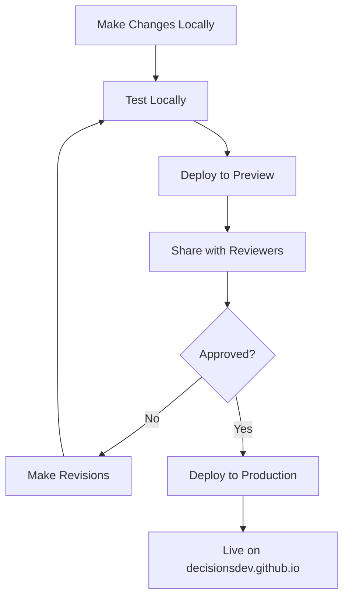

# Preview Deployment Guide

This guide explains how to deploy the DecisionsDev website to a private preview repository in GitHub Enterprise (GHE) for review purposes before publishing to production.

## Table of Contents

- [Overview](#overview)
- [Prerequisites](#prerequisites)
- [Initial Setup](#initial-setup)
- [Deploying to Preview](#deploying-to-preview)
- [Managing Reviewer Access](#managing-reviewer-access)
- [Troubleshooting](#troubleshooting)
- [Preview vs Production](#preview-vs-production)

---

## Overview

The preview deployment workflow allows you to:

- 🔒 **Share privately** - Only invited reviewers can access the preview site
- ✅ **Get feedback** - Collect reviews before publishing to production
- 🔄 **Iterate quickly** - Deploy updates as often as needed
- 🛡️ **Protect production** - Keep the live site stable while testing changes

### How It Works

```
Local Changes → Build Site → Deploy to GHE Preview Repo → Share with Reviewers
```

The preview site is hosted on GitHub Enterprise Pages in a private repository, separate from the public production site.

---

## Prerequisites

Before you can deploy to preview, ensure you have:

1. **GitHub Enterprise Access**
   - Access to your organization's GHE instance
   - Permissions to create repositories in the DecisionsDev organization

2. **Local Development Environment**
   - Node.js and npm installed
   - Git configured with GHE credentials
   - This repository cloned locally

3. **Dependencies Installed**
   ```bash
   npm install
   ```

---

## Initial Setup

### Step 1: Create Preview Repository in GHE

1. Navigate to your GHE instance
2. Go to the DecisionsDev organization
3. Click **New repository**
4. Configure the repository:
   - **Name**: `decisionsdev-preview` (or your preferred name)
   - **Visibility**: **Private** ⚠️ Important!
   - **Initialize**: Leave unchecked (don't add README, .gitignore, or license)
5. Click **Create repository**

### Step 2: Enable GitHub Pages

1. In the preview repository, go to **Settings** → **Pages**
2. Under **Source**, select:
   - **Branch**: `gh-pages`
   - **Folder**: `/ (root)`
3. Click **Save**
4. Note the Pages URL (e.g., `https://your-ghe.com/pages/DecisionsDev/decisionsdev-preview/`)

### Step 3: Add Preview Remote to Local Repository

In your local repository directory, add the preview remote:

```bash
git remote add preview https://your-ghe-instance.com/DecisionsDev/decisionsdev-preview.git
```

Replace `your-ghe-instance.com` with your actual GHE hostname.

**Verify the remote was added:**

```bash
git remote -v
```

You should see both `origin` (production) and `preview` remotes.

### Step 4: Update Preview Scripts (Optional)

If your GHE instance uses a different hostname, update the URLs in:
- `tools/deploy-preview.sh` (line 60)
- `tools/deploy-preview.bat` (line 81)

Replace `your-ghe-instance.com` with your actual GHE hostname.

---

## Deploying to Preview

### Quick Deploy

**On Unix/Mac/Linux:**
```bash
./tools/deploy-preview.sh
```

**On Windows:**
```bash
tools\deploy-preview.bat
```

### What Happens During Deployment

1. ✅ Validates environment (checks for package.json, preview remote)
2. 📦 Installs dependencies (if needed)
3. 🧹 Cleans previous builds
4. 📚 Fetches and categorizes repositories
5. 🔨 Builds the Gatsby site
6. 📤 Deploys to the preview repository's `gh-pages` branch

### Using npm Script

You can also deploy using npm:

```bash
npm run deploy:preview
```

### Deployment Time

- **First deployment**: 2-5 minutes
- **Subsequent deployments**: 1-3 minutes
- **Pages build time**: 1-2 minutes after deployment

---

## Managing Reviewer Access

### Adding Reviewers

1. Go to the preview repository in GHE
2. Navigate to **Settings** → **Collaborators and teams**
3. Click **Add people** or **Add teams**
4. Search for the reviewer by username or email
5. Select **Read** permission (recommended)
6. Click **Add [username] to this repository**

The reviewer will receive an email invitation.

### Permission Levels

| Permission | Can View | Can Comment | Can Edit | Recommended For |
|------------|----------|-------------|----------|-----------------|
| **Read** | ✅ | ✅ | ❌ | Reviewers |
| **Write** | ✅ | ✅ | ✅ | Contributors |
| **Admin** | ✅ | ✅ | ✅ | Maintainers |

**Recommendation**: Use **Read** permission for reviewers to prevent accidental changes.

### Sharing the Preview URL

After deployment, share this URL with reviewers:

```
https://your-ghe-instance.com/pages/DecisionsDev/decisionsdev-preview/
```

**Include in your message:**
- Purpose of the review
- Specific areas to focus on
- Deadline for feedback
- How to provide feedback (issues, email, etc.)

### Removing Access

1. Go to **Settings** → **Collaborators and teams**
2. Find the user/team
3. Click **Remove** or change their permission level

---

## Troubleshooting

### Error: 'preview' remote not configured

**Problem**: The preview remote hasn't been added to your local repository.

**Solution**:
```bash
git remote add preview https://your-ghe-instance.com/DecisionsDev/decisionsdev-preview.git
```

### Error: Permission denied

**Problem**: You don't have push access to the preview repository.

**Solution**:
1. Verify you're a member of the DecisionsDev organization
2. Check your GHE credentials are configured correctly
3. Ensure you have at least Write permission on the preview repository

### Preview site shows 404

**Problem**: GitHub Pages hasn't finished building, or Pages isn't enabled.

**Solutions**:
1. Wait 2-3 minutes and refresh
2. Check **Settings** → **Pages** to ensure it's enabled
3. Verify the `gh-pages` branch exists in the repository
4. Check the Pages build status in the repository's Actions tab

### Changes not appearing

**Problem**: Browser cache or Pages build delay.

**Solutions**:
1. Hard refresh: `Ctrl+Shift+R` (Windows/Linux) or `Cmd+Shift+R` (Mac)
2. Clear browser cache
3. Wait a few minutes for Pages to rebuild
4. Check the deployment timestamp in the repository

### Build fails locally

**Problem**: Dependencies or build errors.

**Solutions**:
1. Delete `node_modules` and reinstall:
   ```bash
   rm -rf node_modules
   npm install
   ```
2. Clear Gatsby cache:
   ```bash
   npm run clean
   ```
3. Check for errors in the build output
4. Ensure all required files are present

---

## Preview vs Production

### Comparison Table

| Aspect | Preview | Production |
|--------|---------|------------|
| **Repository** | `decisionsdev-preview` | `DecisionsDev.github.io` |
| **Visibility** | Private | Public |
| **URL** | `your-ghe.com/pages/.../preview` | `decisionsdev.github.io` |
| **Access** | Invited collaborators only | Anyone on the internet |
| **Remote** | `preview` | `origin` |
| **Purpose** | Review and testing | Live public site |
| **Deploy Command** | `./tools/deploy-preview.sh` | `./tools/deploy.sh` |
| **Update Frequency** | As needed for review | After approval |

### Workflow



### Best Practices

1. **Always preview first** - Deploy to preview before production
2. **Get feedback** - Share with at least 2-3 reviewers
3. **Test thoroughly** - Check all pages and functionality
4. **Document changes** - Keep track of what's being reviewed
5. **Clean up** - Remove reviewer access after deployment to production

---

## Additional Resources

- [Main README](../README.md) - Project overview and setup
- [Deployment Guide](DEPLOYMENT.md) - Production deployment instructions
- [Setup Guide](SETUP.md) - Initial project setup
- [GitHub Pages Documentation](https://docs.github.com/en/pages)

---

## Support

If you encounter issues not covered in this guide:

1. Check the [Troubleshooting](#troubleshooting) section
2. Review the build output for error messages
3. Consult your GHE administrator for access issues
4. Open an issue in the repository

---

*Last updated: 2026-02-23*